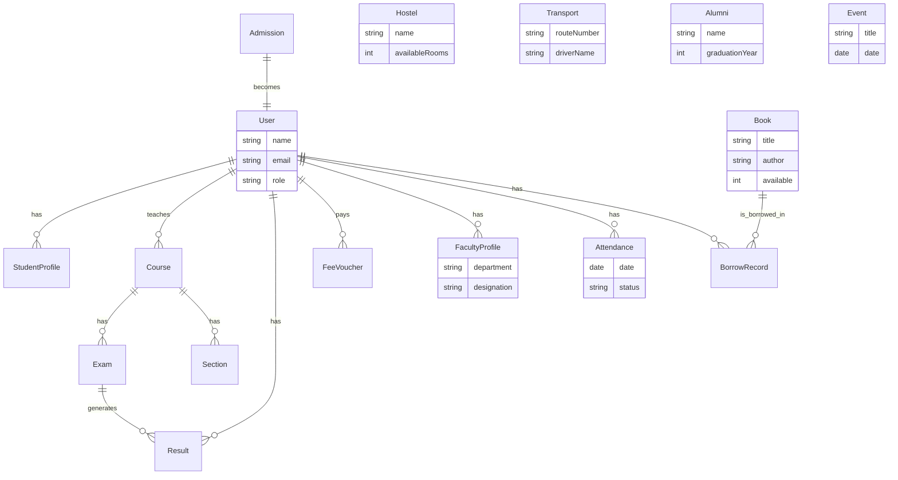

# System Architecture - UVAP

## High-Level Architecture

```mermaid
graph TD
    Client[Client (React + Vite)]
    LB[Nginx Load Balancer]
    API[Backend API (Node/Express)]
    ML[ML Service (Python/Flask)]
    DB[(MongoDB Atlas)]
    Redis[(Redis Cache)]
    Ext[External Services]

    Client --> LB
    LB --> API
    API --> DB
    API --> Redis
    API --> ML
    API --> Ext
    Ext --> Stripe
    Ext --> Twilio
```

## Components

### 1. Frontend (Client)
- **Tech**: React, TailwindCSS, Redux Toolkit.
- **Role**: User Interface for all roles. Consumes REST APIs.

### 2. Backend (API)
- **Tech**: Node.js, Express.js.
- **Role**: Business logic, Auth, Database interaction.
- **Architecture**: Layered (Controller -> Service -> Repository -> Model).

### 3. ML Service
- **Tech**: Python, Flask, Scikit-learn.
- **Role**: Sentiment Analysis, Predictive Analytics.
- **Communication**: REST API (Internal).

### 4. Database
- **Tech**: MongoDB.
- **Role**: Primary data store.
- **Design**: Normalized schemas with references for relations.

### 5. Infrastructure
- **Docker**: Containerization of all services.
- **Nginx**: Reverse proxy and static file serving.

## Entity Relationship Diagram (ERD)


